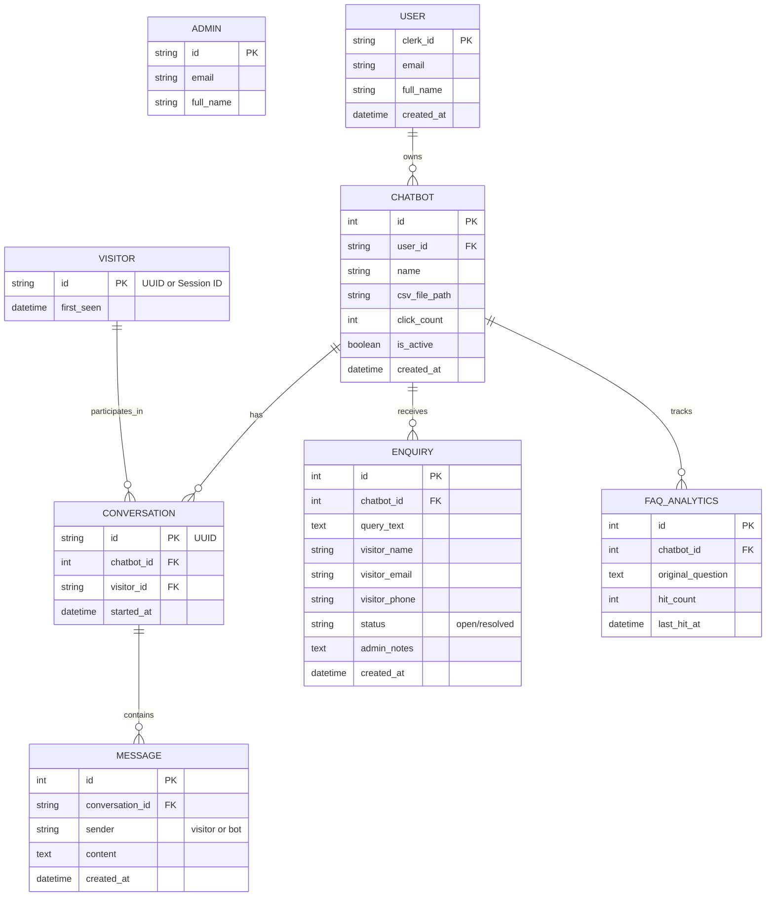
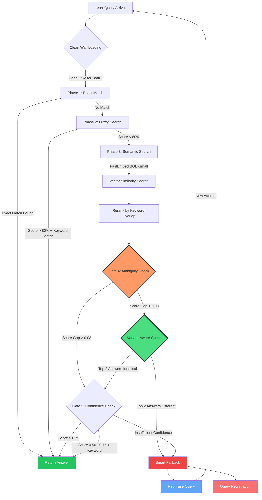

# FAQSense: Intelligent Multi-Tenant FAQ Automation Platform

FAQSense is an AI-powered high-performance, multi-tenant chatbot engine designed to provide instant, reliable customer support. By leveraging a Retrieval-Augmented Matcher (RAM) architecture. It allows multiple organizations to upload their proprietary FAQ data and instantly deploy customized, context-aware chatbots that are guaranteed to remain faithful to the source material. It features a visual flow editor for managing FAQ data and a robust hybrid search engine for answering queries.


## About the Application

### Background & Motivation
In the current AI landscape, Large Language Models (LLMs) often suffer from “hallucinations”—generating confident but factually incorrect information. For businesses, this is a significant liability, as misinformation can erode trust and lead to costly mistakes. FAQSense was born out of the need for a solution that provides the natural feel of AI interaction without the risk of unreliable outputs.
While LLMs are powerful and can perform heavy lifting tasks such as semantic similarity search or contextual matching, relying on them exclusively introduces fragility. Our motivation is to design a system that does not depend on them for core functionality. By combining deterministic methods, curated knowledge bases, and lightweight NLP techniques, FAQSense aims to deliver consistent, trustworthy answers while still offering the conversational fluidity users expect from modern AI systems.

### Main Objective
The primary goal is to provide a low-latency, scalable infrastructure where "Knowledge Retrieval" is the priority. FAQSense ensures that a company's support bot only speaks from the provided "textbook" (CSV data), ensuring 100% factual consistency.

### Why it Matters
In the NLP domain, FAQSense demonstrates that Semantic Search (understanding meaning) can be more valuable than Generative Text for closed-domain applications like customer service. It showcases the practical application of high-dimensional vector embeddings and efficient similarity scoring in a production environment.


## 🚀 Key Features

- **Visual FAQ Management**: A React-Flow based dashboard that allows users to map questions to answers visually, supporting multiple "Question Variants" for a single answer. <br><br>
- **Instantly Deployable Chatbots**: FAQSense provides instantly deployable chatbots that can be embedded into your website or platform with minimal effort. Hosting and deployment are streamlined, requiring only lightweight configuration, so organizations can go live quickly without complex setup. <br><br>
- **Zero-Hallucination Architecture**: Unlike GPT-based bots, FAQSense selects existing answers rather than generating new ones. <br><br>
- **Hybrid Search Engine**: A 5-phase query lifecycle that ensures accurate delivery: <br>
  1. **Exact Match**: Instant response for perfect string matches.
  2. **Fuzzy Search**: Robust handling of user errors via Levenshtein distance-based fuzzy matching.
  3. **Semantic Search**: Understands user intent using the **FastEmbed (BGE-Small)** model.
  4. **Faithfulness Guards**: Keyword reranking and ambiguity checks to prevent "hallucinations."
  5. **Confidence Reranking**: Adaptive thresholds based on model confidence. <br><br>
- **Multi-Tenant Isolation**: Secure data partitioning ensures that Organization A’s bot can never access Organization B’s data. <br><br>
- **Optimized for Deployment**: Leveraging FastEmbed and ONNX Runtime for <100ms startup times and minimal RAM usage on platforms like Render. <br><br>

## 🛠️ Technology Stack

- **Frontend**: React, React-Flow, TailwindCSS.
- **Backend**: Python, FastAPI, SQLAlchemy (MySQL/PostgreSQL), FastEmbed.
- **Persistence**: Hybrid Storage (Database for metadata + CSV for FAQ data with atomic-swap updates).
- **Authentication**: Clerk.

## 📁 Repository Structure

This repository is organized into specific branches for development and deployment:
- `main`: (Current) Documentation and project overview.
- `frontend`: FAQSense Platform for instantly buidling, deployment, analytics and maintenance of chatbots. 
- `backend`: Core backend logic and API services.
- `backend-prod`: Production-optimized backend branch with Sentence-Transformers. 
- `backend-opt-prod`: Production-optimized backend branch with FastEmbed and tuned metrics.


---

## Installation Instructions

### Prerequisites

- **Python 3.9+** (Backend)
- **Node.js 18+** & npm/yarn (Frontend)

---

### 1. Backend Setup

The backend serves the API and handles the embedding matching logic.

#### 1. Clone and Navigate
```bash
git clone https://github.com/suyash-rgb/FAQSense.git
cd FAQSense
```

#### 2. Setup Virtual Environment
```
python -m venv venv
source venv/bin/activate   # On Windows: venv\Scripts\activate
```

#### 3. Install Dependencies
```
pip install -r requirements.txt
```

#### 4. Environment Configuration
Create a .env file in the root directory (refer to .env.example if available) and add your configurations (e.g., DATABASE_URL).


### 2. Frontend Setup
The frontend provides the management dashboard and the chat interface. Note: Ensure you are on the ``frontend`` branch if working on the UI specifically.

#### 1. Navigate to Frontend Directory:
```
cd frontend
```

#### 2. Install Dependencies:
```
npm install
# OR
yarn install
```

#### 3. Environment Configuration
Create a .env.local file in the frontend folder to define your API base URL:
```
VITE_API_BASE_URL=http://localhost:8000
```
### 3. Database 

#### 1. Data Dictionary 

##### Table Overviews

| Table Name | Description | Related Tables |
| :--- | :--- | :--- |
| **`admins`** | System administrators who can monitor and manage chatbots across the platform. | - |
| **`users`** | Registered platform users (chatbot owners) authenticated via Clerk. | `chatbots` |
| **`visitors`** | End-users who interact with the chatbots on external websites. | `conversations` |
| **`chatbots`** | The AI agents created by users to serve FAQ content via CSV. | `users`, `conversations`, `enquiries`, `faq_analytics` |
| **`conversations`** | Session-based interaction logs between a visitor and a specific chatbot. | `chatbots`, `visitors`, `messages` |
| **`messages`** | Individual chat messages within a conversation. | `conversations` |
| **`enquiries`** | Lead capture data when a visitor submits a contact form via the bot. | `chatbots` |
| **`faq_analytics`** | Performance tracking for specific FAQ questions. | `chatbots` |

---

##### Column-Level Definitions

##### Table: `users`
| Column | Type | Constraints | Description |
| :--- | :--- | :--- | :--- |
| `clerk_id` | String(255) | PK | Unique ID provided by Clerk Auth. |
| `email` | String(255) | Unique, Index | User's primary email address. |
| `full_name` | String(255) | - | Legal name of the user. |
| `created_at` | DateTime | Default: Now | Timestamp when the user registered. |

##### Table: `chatbots`
| Column | Type | Constraints | Description |
| :--- | :--- | :--- | :--- |
| `id` | Integer | PK, Index | Unique internal ID for the chatbot. |
| `user_id` | String(255) | FK (users) | Clerk ID of the owner. |
| `name` | String(255) | - | Human-readable name of the bot. |
| `csv_file_path` | String(255) | - | Storage path for the FAQ data source. |
| `click_count` | Integer | Default: 0 | Total interactions recorded. |
| `is_active` | Boolean | Default: True | Whether the bot is currently serving. |
| `created_at` | DateTime | Default: Now | Timestamp of bot creation. |

##### Table: `conversations`
| Column | Type | Constraints | Description |
| :--- | :--- | :--- | :--- |
| `id` | String(255) | PK (UUID) | Unique session identifier. |
| `chatbot_id` | Integer | FK (chatbots) | The bot serving this session. |
| `visitor_id` | String(255) | FK (visitors) | The relative visitor identifying their session. |
| `started_at` | DateTime | Default: Now | When the chat session began. |

##### Table: `messages`
| Column | Type | Constraints | Description |
| :--- | :--- | :--- | :--- |
| `id` | Integer | PK | Unique message ID. |
| `conversation_id`| String(255) | FK (conv.) | The parent session UUID. |
| `sender` | String(50) | - | Either `"visitor"` or `"bot"`. |
| `content` | Text | - | The message body/content. |
| `created_at` | DateTime | Default: Now | Time message was sent. |

##### Table: `enquiries`
| Column | Type | Constraints | Description |
| :--- | :--- | :--- | :--- |
| `id` | Integer | PK | Unique lead ID. |
| `chatbot_id` | Integer | FK (chatbots) | Bot that generated this lead. |
| `query_text` | Text | - | The question or message submitted by visitor. |
| `visitor_name` | String(255) | - | Name of the person enquiring. |
| `visitor_email` | String(255) | - | Contact email provided. |
| `status` | String(50) | Default: "open" | State of the lead (open/resolved). |
| `admin_notes` | Text | - | Internal notes for the admin. |

##### Table: `faq_analytics`
| Column | Type | Constraints | Description |
| :--- | :--- | :--- | :--- |
| `id` | Integer | PK | Unique record ID. |
| `chatbot_id` | Integer | FK (chatbots) | Bot tracking this FAQ. |
| `original_question`| Text | - | The exact question from the CSV source. |
| `hit_count` | Integer | Default: 0 | Number of times this FAQ was triggered. |
| `last_hit_at` | DateTime | Default: Now | Most recent usage timestamp. |

#### 2. Entity Relationship (ER) Diagram


## Usage Guide

### Running the Services

To run the full application, you need to start both the backend and frontend servers.

#### 1. Start Backend
Run this from the project root (backend directory):
```bash
uvicorn app.main:app --reload
```

#### 2. Start Frontend
Navigate to the frontend directory and start the development server:
```bash
npm run dev
```

---

### Example API Interaction

#### Endpoint: `POST /chatbots/{chatbot_id}/ask`
(Note: Replace `{chatbot_id}` with your actual chatbot ID, e.g., `1`)

**Payload:**
```json
{
  "question": "What is the return policy?",
  "conversation_id": "optional-session-uuid"
}
```

**Response Example:**
```json
{
  "answer": "Yes, we offer a 45-day return window for all premium members."
}
```

> [!TIP]
> **Advanced Responses**: If you have enabled semantic matching in the engine, your responses will be highly accurate even for slightly different phrasings.

---

#### Lead Generation (Enquiries)
To register a visitor's contact details when they ask a complex question:

**Endpoint:** `POST /chatbots/{chatbot_id}/enquiries`

**Payload:**
```json
{
  "query_text": "I need help with custom enterprise pricing",
  "visitor_name": "John Doe",
  "visitor_email": "john@example.com",
  "visitor_phone": "+123456789"
}
```


<br><br>

## Technical Details

### Core Technologies

*   **FastAPI**: A high-performance, asynchronous backend framework for Python, used to serve the core API and handle webhook/request routing.
*   **FastEmbed**: A lightweight, high-speed Python library for generating embeddings. It uses quantized models to provide high accuracy with minimal RAM overhead.
*   **PyTorch/ONNX**: Optimized backend runtimes utilized for vector operations and model inference, ensuring fast response times on CPU-only environments.
*   **React & Tailwind CSS**: The frontend is built using a modern architecture for highly responsive and visually appealing user interfaces.

---

### Search & NLU Pipeline

#### 1. Multi-Phase "Waterfall" Matching
To ensure maximum speed, every query passes through a sequential waterfall:
*   **Phase 1: Exact Match**: Instant lookup for identical strings (case-insensitive and whitespace-invariant).
*   **Phase 2: Fuzzy Search**: Uses `rapidfuzz` to handle typos and minor spelling variations (e.g., "refinds" → "refunds").
*   **Phase 3: Semantic Search**: The final, most powerful layer for understanding deep intent using FastEmbed.
*By failing fast at the earlier layers, we save compute cycles for simple queries.*

#### 2. Design Choice: Why Cosine Similarity?
FAQSense uses **Cosine Similarity** to compare query vectors against the FAQ knowledge base. This choice was driven by:
*   **Length Agnosticism**: It measures the *angle* between vectors. This allows a 3-word query and a 20-word entry to match perfectly if their semantic "direction" is the same.
*   **CPU Efficiency**: When paired with FastEmbed, calculating similarity across 1,000 rows takes less than **1ms**, eliminating the need for expensive GPUs.
*   **Scalability**: Local vector math is faster than a network trip to an external vector database for typical FAQ datasets.

#### 3. Hybrid Reranking (Faithfulness Guardrails)
To prevent "hallucinated" matches where a model guesses intent without context:
*   **Keyword Overlap**: The system extracts key terms, normalizing for simple plurals (e.g., "refund" matches "refunds").
*   **Weighted Decision**: A match is only accepted if it meets a high semantic threshold *OR* passes a minimum keyword overlap count. This ensures the answer is faithful to the specific terms in the query.

---

### Performance & Security

#### 1. Reactive In-Memory Caching
To handle high traffic without stressing the disk:
*   **CSV File Monitoring**: The system tracks the `mtime` (last modified) of CSV files. It only reloads data if a change is detected.
*   **Embedding Caching**: FAQ vectors are cached in memory after the first calculation, enabling subsequent queries to perform at near-instant speeds.

#### 2. Tenant Isolation (Clean Wall)
FAQSense follows a strict **Clean Wall Architecture**:
*   **File Isolation**: Each chatbot's data is stored in a separate, isolated `chatbot_{id}.csv` file. 
*   **Stateless Engine**: The logic requires a specific `chatbot_id` for every operation, ensuring user data leakage between bots is architecturally impossible.

---

### Model Migration: From MiniLM to FastEmbed

FAQSense recently underwent a significant architectural migration to optimize for performance and accuracy.

#### Transition Overview
*   **Legacy Model**: `sentence-transformers` (all-MiniLM-L6-v2) 
*   **Current Model**: **FastEmbed** (`BAAI/bge-small-en-v1.5`)
*   **Runtime**: Switched from PyTorch-heavy inference to **ONNX Runtime**, reducing startup time from ~8 seconds to **<100ms** (via lazy loading).

#### Metric Tuning for BGE-small-en-v1.5
The BGE model produces a tighter, higher-scoring distribution. To prevent false positives, we tuned our matching thresholds:

| Metric | Legacy (MiniLM) | Current (BGE-Small) | Reasoning |
| :--- | :--- | :--- | :--- |
| **Semantic Match** | 0.35 | **0.50** | Prevents matches for unrelated queries. |
| **Confidence Level** | 0.60 | **0.75** | Required score to bypass keyword overlap. |
| **Ambiguity Gap** | 0.15 | **0.03** | Adjusted for the denser score gap in BGE. |
| **Near-Perfect Match** | N/A | **0.92** | Absolute trust threshold for semantic matches. |

#### Variant-Aware Ambiguity Logic
A key technical refinement was making our Ambiguity Guard **"Variant-Aware"**. 
*   **The Problem**: If a bot has two similar question variants pointing to the same answer, the system would previously flag them as "ambiguous" because their scores were too close.
*   **The Solution**: The system now compares the **Answers** of the top results. If the scores are close but they point to the **same answer node**, the match is allowed. This supports advanced FAQ structures where one answer has multiple semantic entry points.

### Query LifeCycle: Verified Logic

We verified the 5-phase lifecycle through comprehensive integration testing:

1.  **Phase 1: Arrival (Clean Wall)**: Verified that Bot A cannot see Bot B's data via filepath isolation.
2.  **Phase 2: Exact Match**: Verified case-insensitive/whitespace-insensitive matching.
3.  **Phase 3: Fuzzy Match**: Verified typo handling (e.g., "refinds" → "refunds").
4.  **Phase 4: Semantic Search**: Verified intent matching (e.g., "money back" → "refunds").
5.  **Phase 5: Safety Guardrails**:
    - **Keyword Guard**: Rejects generic queries (e.g., "Tell me about finances") even if the semantic score is moderately high, unless keyword overlap exists.
    - **Ambiguity Guard**: Prevents "guessing" when two FAQ questions are semantically too close.

---

#### Query LifeCycle / NLU Pipeline



<br><br>
### Operational Observations
- **Startup Time**: < 100ms (Down from ~8s).
- **First-Query Latency**: ~1.5s (Model init overhead).
- **Subsequent Queries**: < 50ms.
- **Memory Footprint**: Significantly reduced due to ONNX Runtime optimizations.

  


---

## Contributing

We welcome contributions!

1. Fork the Project.

2. Create your Feature Branch (git checkout -b feature/AmazingFeature).

3. Commit your Changes (git commit -m 'Add some AmazingFeature').

4. Push to the Branch (git push origin feature/AmazingFeature).

5. Open a Pull Request.

© 2026 FAQSense Team. All rights reserved.
